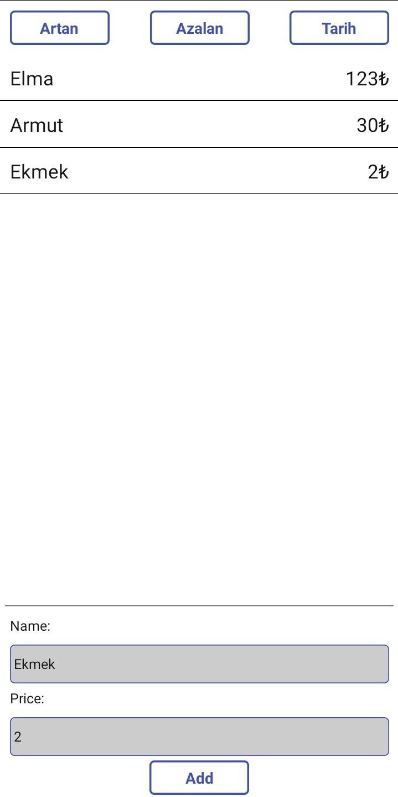

# React Native Product Prices List App

### Before you start

***App-name*** requires a couple of previous steps to start with the installation. 

- You will need to have [npm](https://www.npmjs.com/) to install the application dependencies. If you don't have it, please follow [these](https://www.npmjs.com/get-npm) steps to install it.
- You will need to belong to an Apple organization development team for this project in order to run the application on iOS. 
- Also, this is a React Native project, so you must install React Native. Follow [these](https://facebook.github.io/react-native/docs/getting-started.html#content) steps to do it.

### Installation

1. Clone the repo locally:

```sh
git clone https://github.com/fuatguzel/rn-homework-tracking-app.git
```

2. Navigate into project
```sh
cd rn-homework-tracking-app
```

3. Install dependencies
```sh
npm install 
```

4. Configurate iOS project
```sh
cd ios
pod install
```

5. Go back to main project folder
```sh
cd ..
```

### Run application

##### iOS #####
1. Open application in xcode
```sh
cd ios
open <App-name>.xcworkspace
```

2. Configure signing on project target
- Tap on app-name project
- Tap Signing & Capabilities tab
- Tap on app-name target
- On Team field, choose the development team from your apple account

3. Run the application: Product -> Run or just the play button

##### Android #####

1. Connect the device to your computer
2. Run application
```sh
npm run android
```

### Run tests
1. Navigate into main project folder
2. Execute tests
```sh
npm run test
```

### Tips

- Shake device to open developer tools
  - Tap "Reload" to refresh application
  - Tap "Show Inspector" to get a nice layout/component inspector inside your application.
  - Tap "Hide Inspector" to hide the inspector.


## TODOs

- [ ] Filter buttons must be work.
- [ ] When the items add to the FlatList must immediately change

## Screenshot


